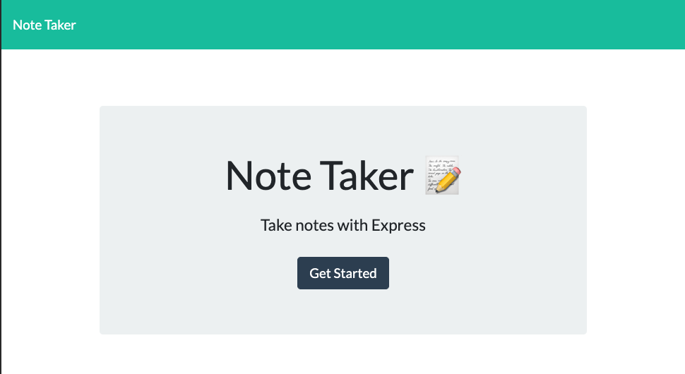
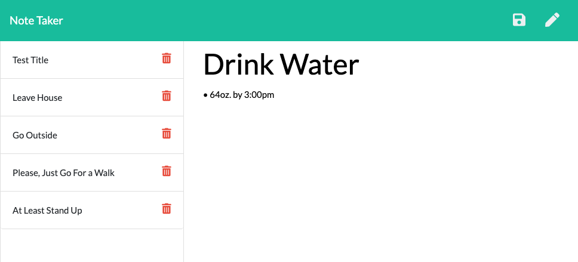

# Team Profile Generator
  
  
  ## Description
  
  Note Taker's landing page will guide the user to a note taking page where one can enter notes and save them. Each note will be stored in the left-hand column in the browser. This app was built using Node.js; NPM's Express, FS, Path, & Router; JavaScript; HTML; & CSS. 

  ## Table of Contents

  * [Usage](#usage)
  * 
  * [Contributors](#contributors)
  * [Questions](#questions)
  
  ## Usage

  [Note Taker](https://note-taker-joel-challenge11.herokuapp.com/)

  Click the link above to visit the deployed application. Then click the 'Get Started' button on the landing page. Write your note into the right column of the page and click the Save button in the upper right corner. The saved note will appear in the column on the left.

  

  

  ## Contributors

  Joel Cox

  ## License
      
        This project is licensed under the MIT License.
      

  ## Questions

  If there are any further questions, please feel free to reach out to me. 

  - Email: joelecox1@gmail.com
  - GitHub: [joelecox1](https://github.com/joelecox1)